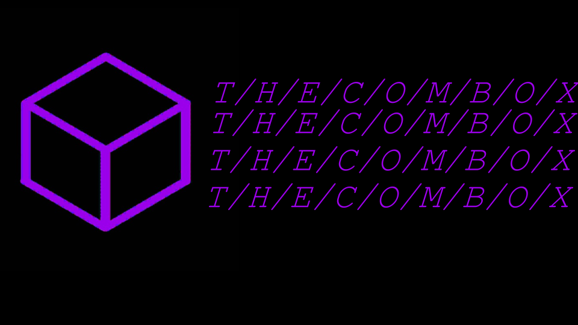

# ComBox App Vue



[English](./README.md) | [Русский](./README.ru.md)

Vue 3 frontend для ComBox. Это основной UI мессенджера: auth flow, chat workspace, группы/топики, media viewers, настройки в sidebar, emoji/GIF picker и realtime-интеграция через `combox-api`.

## Технологии

[](https://vuejs.org)
[](https://router.vuejs.org)
[](https://vuetifyjs.com)
[](https://webpack.js.org)
[](https://www.typescriptlang.org)

## Что умеет

- auth flow для register/login/profile bootstrap
- основной chat layout с sidebar, conversation area, info panel и overlays
- группы, каналы/топики и topic sidebar flow
- message list, reactions, context menus, media previews/viewers
- sidebar settings/profile UI
- emoji/GIF picker с recent emoji и GIF search
- i18n dictionaries
- интеграция с `combox-api` для HTTP + realtime

## Архитектура (высокоуровнево)

```text
          Browser
             |
             v
      [ ComBox App Vue ]
             |
   +---------+-------------------------+
   |                                   |
   v                                   v
 Vue Router                      Chat workspace runtime
 /auth / /settings              sidebar, messages, overlays,
                                info panel, composer, media
             |
             v
         combox-api
             |
             v
   backend REST + WebSocket endpoints
```

## Особенности стека

- runtime приложения построен на Vue 3 SFC
- bundling/dev server — Webpack
- часть UI использует Vuetify primitives, но большая часть chat UI кастомная
- пакет `combox-api` подключён локально из `../combox-api`

## Скрипты

```bash
npm install
npm run dev
```

Основные команды:

- `npm run dev` - webpack dev server на `0.0.0.0:4173`
- `npm run build` - production webpack build + type check
- `npm run check` - TypeScript project build/check
- `npm run lint` - ESLint
- `npm run preview` - раздача готового `dist/`

## Runtime-настройки

По умолчанию приложение общается с backend через стандартные настройки `combox-api`:

- private API base выводится из browser location
- WebSocket base выводится из browser location

При необходимости можно переопределить через env:

- `VITE_API_BASE_URL`
- `VITE_WS_BASE_URL`

## Основные зоны UI

- `src/components/auth/` - auth flow
- `src/components/chat/` - chat workspace, sidebar, composer, info panel, media, pickers
- `src/pages/` - верхнеуровневые routed pages
- `src/i18n/` - dictionaries и translation helpers
- `src/utils/` - небольшие frontend helpers

## Структура проекта

- `src/main.ts` - bootstrap приложения
- `src/router/` - маршруты
- `src/pages/` - page containers
- `src/components/` - UI components
- `src/i18n/dicts/` - локализованные строки
- `public/` - статические assets и fonts
- `webpack.config.cjs` - конфиг сборки
- `Dockerfile` / `docker-compose*.yml` - контейнерные режимы запуска

## Заметки по разработке

- большая часть chat-логики живёт в `useChatWorkspace.runtime.ts`
- весь UI text должен жить в dictionaries, а не в hardcoded строках
- avatar fallback и theme tokens должны быть визуально согласованы между sidebar/chat/info/settings
- локальная память/заметки по проекту лежат в `../_memory/`

## Edge deployment

В репе уже есть edge-ориентированные compose-файлы:

- `docker-compose.edge.yml`
- `docker-compose.edge.dev.yml`

Они рассчитаны на запуск behind `combox-edge`, обычно без прямой публичной публикации, кроме маршрута через edge gateway.

## Лицензия

<a href="./LICENSE">
  
</a>

## Автор

[Ernela](https://github.com/Ernous) - Разработчица;
[D7TUN6](https://github.com/D7TUN6) - Идея, разработчик
